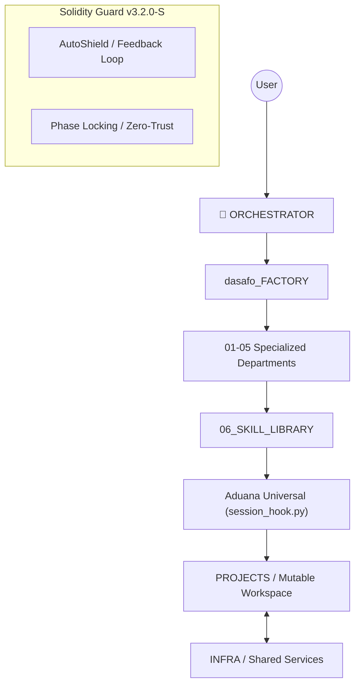

# 🏛️ dasafo_Systems | Multi-Agent AI Factory v3.2.0-S

<p align="center">
  
  
  
  
  
</p>

## 🚀 Vision: Industrializing AI Excellence

**dasafo_Systems** is a high-performance, stateless AI Multi-Agent Factory designed to scale software engineering with surgical precision and premium aesthetics. The v3.2.0-S **"Modular Toolbox"** update transforms the ecosystem into a fully decoupled, skill-driven engine where agents operate under strict industrial laws (**Solidity Guard**) and continuous learning loops (**AutoShield**).

---

## 🏗️ Ecosystem Architecture

The system is organized into three specialized nodes that ensure total isolation and scalability:



### 🧠 1. The Brain: `dasafo_FACTORY/`

The immutable repository of identity, laws, and executive power.

* **`00_GLOBAL_KNOWLEDGE`**: The Factory Constitution. Coding standards, ADR laws, and scientific rigor.
* **`01_STRATEGY_AND_MARKETING`**: Mission definition and growth strategy.
* **`02_ARCHITECTURE_AND_RESEARCH`**: System design and semantic discovery.
* **`03_PRODUCTION`**: Atomic development (Frontend, Backend, Data).
* **`04_COMPLIANCE_AND_QUALITY`**: Guardians of Solidity (QA, Security, Docs).
* **`05_OPERATIONS`**: Deployment, SRE, and Factory Evolution.
* **`06_SKILL_LIBRARY`**: The **Modular Toolbox**. 80+ executable Python modules (`run.py`) invoked via the centralized `skill_engine.py`.

### 🧱 2. The Power Grid: `INFRA/`

Centralized "Vivero" of high-performance shared services for all projects.

* **Neo4j (`kg-db`)**: Central Knowledge Graph (4GB RAM limit).
* **Postgres (`shared-db`)**: Relational operational storage (2G RAM limit).
* **Glances**: Real-time health and performance monitoring node.
* **Isolated Network**: All services communicate via the internal `dasafo_network`.

### 🛠️ 3. The Workshop: `PROJECTS/`

The mutable workspace where projects are born and evolved.

* **WORKSPACE**: Production-ready code (Backend, Frontend, Shared).
* **TASKS (Industrial Kanban)**: Physical task mirroring (`01_PENDING` to `05_REJECTED`).
* **LOGS**: Granular telemetry of every agent session and incident.

---

## ⚙️ The Modular Engine (v3.2.0-S)

Unlike standard AI setups, dasafo_Systems uses a **Skill-Based Executive Engine**:

* **`factory_cli.py` (MCP Bridge)**: Seamless communication between the assistant and the factory.
* **`skill_engine.py`**: Dynamic module loading for total portability.
* **`skill_schema.py`**: Standardized contracts (`SkillInput`/`SkillOutput`) ensuring that actions are predictable and auditable.
* **`session_hook.py` (Aduana Universal)**: The **Physical Enforcement Layer**. Intercepts every tool call to verify project state before execution, ensuring zero phase-skipping.

---

## 🛡️ Solidity & Security Protocols

* **Customs Protocol (Aduana Universal)**: Zero phase-skipping. Transitions (M1-M5) are blocked until all tasks are physically verified.
* **AutoShield Loop**: Every project failure or hallucination is recorded in `FEEDBACK-LOG.md`. The system "learns" and prevents these errors in future runs.
* **Atomic Design**: Mandatory premium UI standards (Glassmorphism, Dark Mode, Micro-animations).
* **SI Unit Mandate**: 100% enforcement of metric standards for technical and scientific data.

---

## 🕹️ Power Commands (Slash Commands)

| Command | Industrial Impact |
| :--- | :--- |
| **`/factory-orchestrate`** | Advances the industrial pipeline and assigns next-phase tasks. |
| **`/scan`** | Executes the `agentic-thought-secret-scanner` and quality audits. |
| **`/factory-status`** | Visual report of project progress and infrastructure health. |
| **`/audit`** | Destructive requirement validation before final task closure. |
| **`/arch-diagram`** | Generates real-time Mermaid architecture diagrams. |

---

## 🚀 Quick Start: Deployment

1. **Initialize Infrastructure**:

    ```bash
    cd dasafo_Systems/INFRA
    cp .env.shared .env  # Configure your secure passwords
    docker-compose up -d
    ```

2. **Bootstrap a Project**:

    ```bash
    cd dasafo_FACTORY
    ./init_project.sh ProjectName
    ```

3. **Define Strategy**:
    Invoke the **PRODUCT_OWNER** 📋 to draft the `PRP_CONTRACT.json` in `LOCAL_KNOWLEDGE/`.
4. **Execute Phase M1**:
    Once the contract is signed by the human, use **`/factory-orchestrate`** to begin the mission.

---

<p align="center">
  <i>"Industrializing the Future of Autonomous Software Engineering"</i>
</p>

---
*v3.2.0-S Modular Toolbox | dasafo_Systems — Solidity, Vibe, Industrialization.*
