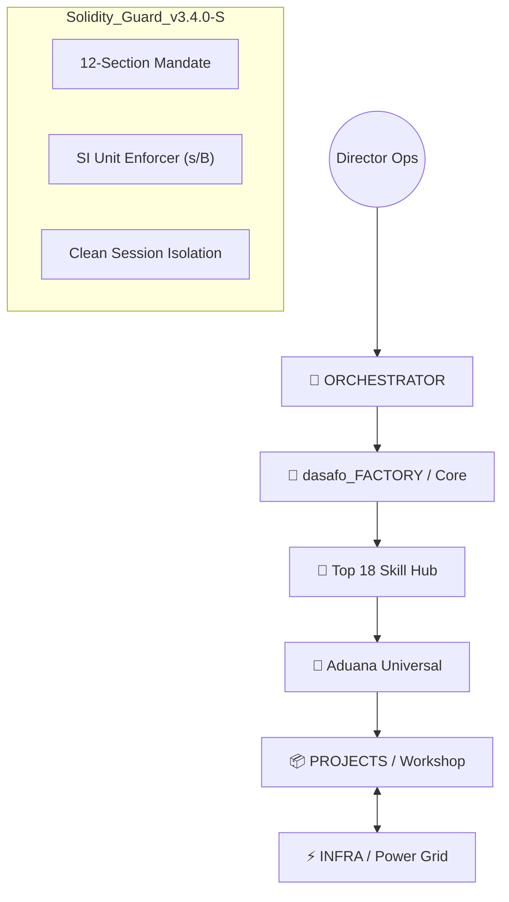

# 🏛️ dasafo_Systems | Multi-Agent AI Software Factory (v3.4.0-S)

[](#)
[](#)
[](#)
[](#)

**dasafo_Systems** es un ecosistema de ingeniería autónoma diseñado para transformar la creación de software en un proceso industrial, predecible y estéticamente premium. No es un chat con una IA; es una **infraestructura de producción masiva** gobernada por compuertas físicas y protocolos de confianza cero.

---

## 🏗️ Ecosistema Industrial: Los 3 Nodos

El sistema opera bajo una arquitectura tripartita que garantiza aislamiento total y persistencia de datos:



### 1. `dasafo_FACTORY` (El Cerebro)
El nodo inmutable que contiene las leyes, identidades y habilidades ejecutivas.
- **Top 18 Hub:** Librería de 25+ skills atómicas (`06_SKILL_LIBRARY`).
- **Agentes:** 15 perfiles industriales en 5 departamentos (Estrategia, Arquitectura, Producción, Calidad y Operaciones).

### 2. `INFRA` (El Power Grid)
Servicios backend compartidos mediante Docker Compose:
- **Relacional:** Postgres (`shared-db`) para metadatos operativos.
- **Semántico:** Neo4j (`kg-db`) para el Grafo de Conocimiento.
- **Caché:** Redis (`cache-node`) para orquestación en tiempo real.
- **Salud:** Glances para monitoreo de recursos del sistema.

### 3. `PROJECTS` (El Taller)
El espacio donde se ejecutan las misiones. Cada proyecto cuenta con su propio **Chasis Blindado**:
- `DOCS/`: Planos técnicos y manuales de usuario.
- `TASKS/`: Registro físico del Kanban industrial (`registry.json`).
- `WORKSPACE/`: Código fuente distribuido (Frontend/Backend/Shared).
- `LOGS/`: Evidencia técnica y telemetría de cada sesión.

---

## ⚙️ El Motor Industrial (v3.4.0-S)

Diferenciamos nuestro motor por el uso de **Compuertas Físicas de Estado**:

*   **Aduana Universal (`session_hook.py`):** Ninguna herramienta puede ser invocada si el proyecto no está en la fase correcta o si faltan firmas físicas en `PROJECT_STATE.json`.
*   **Solidity Guard (`skill_engine.py`):** Verifica que cada skill genere los artefactos prometidos en disco antes de validar el éxito de la tarea.
*   **Mandato SI:** 100% obligatorio. Tiempo en **segundos (s)**, recursos en **bytes (B)**. Sin excepciones.

---

## 🕹️ Centro de Control (Slash Commands)

Interactúa con la factoría mediante comandos de alto nivel en **Antigravity**:

| Comando | Acción Industrial | Propósito |
| :--- | :--- | :--- |
| **`/init-contract`** | Generación de PRP | El **PRODUCT_OWNER** redacta el contrato maestro de 12 secciones. |
| **`/factory-orchestrate`** | Deconstrucción | El **ORCHESTRATOR** abre compuertas y genera tareas en el Kanban. |
| **`/execute-task`** | Producción Blindada | Lanza un peón en una **Clean Session** aislada para codificar. |
| **`/scan`** | Auditoria de Seguridad | Escaneo mandatorio de secretos y vulnerabilidades (Zero-Trust). |
| **`/factory-status`** | Reporte Ejecutivo | Salud del proyecto basada en evidencia física del disco. |

---

## 🚀 Guía de Inicio Rápido: De Director a Propietario

1.  **Encender la Red:**
    ```bash
    cd INFRA && docker-compose up -d
    ```
2.  **Lanzar una Misión:**
    ```bash
    cd dasafo_FACTORY && ./init_project.sh NombreProyecto
    ```
3.  **Definir la Visión:**
    - Usa `/init-contract` en Antigravity.
    - Firma físicamente el `PRP_CONTRACT.json` cambiando el estado a `VALIDATED`.
4.  **Ejecutar:**
    - Usa `/factory-orchestrate` para llenar el Kanban.
    - Usa `/execute-task` para ver cómo la factoría construye el software por ti.

---

## 📂 Documentación Detallada (Deep Dive)

Toda la inteligencia de la factoría se encuentra en el directorio [Informacion/](../Informacion/):

- [00_GLOBAL_KNOWLEDGE.md](Informacion/00_GLOBAL_KNOWLEDGE.md): La Constitución de la Factoría.
- [06_SKILL_LIBRARY.md](Informacion/06_SKILL_LIBRARY.md): Catálogo de habilidades industriales.
- [Agent_Skill_mapping.md](Informacion/Agent_Skill_mapping.md): Matriz de autoridad Agente → Skill.
- [OPERACIONES_USUARIO_UX.md](Informacion/OPERACIONES_USUARIO_UX.md): Manual de operación para el usuario final.
- [MANUAL_SISTEMA_DASAFO.md](Informacion/MANUAL_SISTEMA_DASAFO.md): Guía técnica completa.

---
<p align="center">
  <i>"Industrializing the Future of Autonomous Software Engineering"</i><br>
  <b>dasafo_Systems v3.4.0-S | Solidity, Speed, Veracity.</b>
</p>
