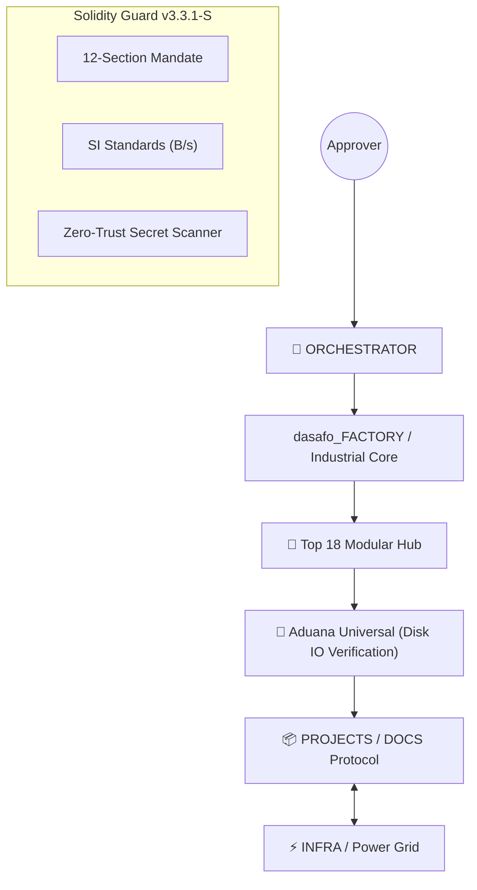

# 🏛️ dasafo_Systems | Multi-Agent AI Factory v3.3.1-S

<p align="center">
  
  
  
  
  
</p>

## 🚀 Vision: Industrializing the AI Lifecycle

**dasafo_Systems** is a high-performance, stateless Multi-Agent Factory engineered for surgical excellence and industrial reliability. With the **v3.3.1-S "Industrial Core"** update, the ecosystem transitions into a strictly governed environment: **Top 18 Hub** skill mapping, **12-Section PRP** contracts, and the **Aduana Universal** phase-gate protocol.

---

## 🏗️ Ecosystem Architecture

The system is organized into three specialized nodes that ensure total isolation and industrial scalability:



### 🧠 1. The Core: `dasafo_FACTORY/`
The immutable heart of identity, laws, and executive skills.
* **`00_GLOBAL_KNOWLEDGE`**: The Factory Constitution. ADRs, SI Units, and the 12-Section PRP Mandate.
* **`01-05 Depts`**: Specialized agent hierarchies from Strategy to Operations.
* **`06_SKILL_LIBRARY`**: The **Industrial Hub**. Centralized, auditable skills (`run.py`) mapped to the Top 18 essential capabilities.

### ⚡ 2. The Power Grid: `INFRA/`
Centralized "Vivero" of high-performance shared services for all missions.
* **Supabase / Postgres**: Relational operational storage.
* **Neo4j**: Central Knowledge Graph for complex semantic mapping.
* **Redis**: Industrial cache node for task and state orchestration.
* **Glances**: Real-time health dashboard for the entire grid.

### 📦 3. The Workshop: `PROJECTS/`
The mutable workspace governed by the **DOCS Protocol** and **Phase-Gate** logic.
* **`DOCS/`**: Architectural Blueprints (`PRP_CONTRACT.json`) and User Manuals.
* **`TASKS/`**: Physical JSON task artifacts mirrored by the **`registry.json`**.
* **`LOGS/`**: Atomic telemetry and `BUILD_REPORT.json` (The Proof of Work).

---

## ⚙️ The Industrial Engine (v3.3.1-S)

Unlike standard AI setups, dasafo_Systems uses a **Physical Gate-Based Executive Engine**:
* **`factory_cli.py`**: The MCP sensory bridge to the assistant.
* **`skill_engine.py`**: Dynamic loader for the Top 18 Hub skills.
* **`session_hook.py`**: The **Aduana Universal**. Intercepts every action to verify that the project is in a valid phase (M1-M5) and that previous gates are physically signed.

---

## 🛡️ Solidity & Security

* **12-Section PRP Mandate**: Every project must have a signed technical contract before M2.
* **Aduana Universal Phase-Gate**: All transitions require physical signing in `PROJECT_STATE.json` by the human (HITL).
* **SI Unit Mandate**: 100% enforcement of metric standards (**B**ytes / **s**econds).
* **Vegetarian Standard**: Surgical language only. No meat/slaughter analogies.

---

## 🕹️ Active Project Command Center
| command | impact |
| :--- | :--- |
| **`/factory-status`** | Full health report of project phases and disk IO truth. |
| **`/factory-orchestrate`** | The factory master's push to the next industrial gate. |
| **`/scan`** | Multi-agent quality and secret audit (Zero-Trust). |

---

## 🚀 Quick Start: Deployment
1. Initializing the Grid:
    ```bash
    cd dasafo_Systems/INFRA
    cp .env.shared .env  # Secure your industrial node
    docker-compose up -d
    ```
2. Launching a Mission:
    ```bash
    cd dasafo_FACTORY
    ./init_project.sh <ProjectName>
    ```

---
<p align="center">
  <i>"Industrializing the Future of Autonomous Multi-Agent Engineering"</i>
</p>

---
*v3.3.1-S Industrial Core | dasafo_Systems — Solidity, Vibe, Veracity.*
