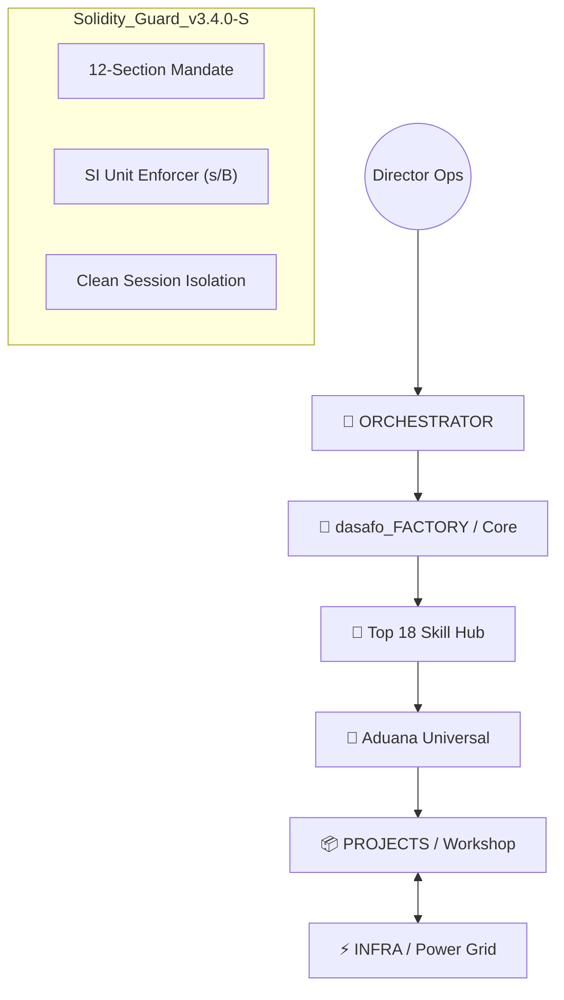

# 🏛️ dasafo_Systems | Multi-Agent AI Software Factory (v3.4.0-S)

[](#)
[](#)
[](#)
[](#)

**dasafo_Systems** is an autonomous engineering ecosystem designed to transform software creation into an industrial, predictable, and aesthetically premium process. It is not just an AI chat; it is a **mass production infrastructure** governed by physical gates and zero-trust protocols.

---

## 🏗️ Industrial Ecosystem: The 3 Nodes

The system operates under a tripartite architecture that ensures total isolation and data persistence:



### 1. `dasafo_FACTORY` (The Brain)

The immutable node containing the laws, identities, and executive skills.

- **Top 18 Hub:** Library of 25+ atomic skills (`06_SKILL_LIBRARY`).
- **Agents:** 15 industrial profiles across 5 departments (Strategy, Architecture, Production, Compliance, and Operations).

### 2. `INFRA` (The Power Grid)

Shared backend services managed via Docker Compose:

- **Relational:** Postgres (`shared-db`) for operational metadata.
- **Semantic:** Neo4j (`kg-db`) for the Knowledge Graph.
- **Cache:** Redis (`cache-node`) for real-time orchestration.
- **Health:** Glances for system resource monitoring.

### 3. `PROJECTS` (The Workshop)

The space where missions are executed. Each project has its own **Armored Chassis**:

- `DOCS/`: Technical blueprints and user manuals.
- `TASKS/`: Physical record of the industrial Kanban (`registry.json`).
- `WORKSPACE/`: Distributed source code (Frontend/Backend/Shared).
- `LOGS/`: Technical evidence and telemetry for each session.

---

## ⚙️ The Industrial Engine (v3.4.0-S)

Our engine is distinguished by the use of **Physical State Gates**:

- **Aduana Universal (`session_hook.py`):** No tool can be invoked if the project is not in the correct phase or if physical signatures are missing in `PROJECT_STATE.json`.
- **Solidity Guard (`skill_engine.py`):** Verifies that each skill generates the promised artifacts on disk before validating the task's success.
- **SI Mandate:** 100% mandatory. Time in **seconds (s)**, resources in **bytes (B)**. No exceptions.

---

## 🕹️ Command Center (Slash Commands)

Interact with the factory using high-level commands in **Antigravity**:

| Command | Industrial Action | Purpose |
| :--- | :--- | :--- |
| **`/init-contract`** | PRP Generation | The **PRODUCT_OWNER** drafts the 12-section master contract. |
| **`/factory-orchestrate`** | Deconstruction | The **ORCHESTRATOR** opens gates and generates tasks in the Kanban. |
| **`/execute-task`** | Armored Production | Launches a worker in an isolated **Clean Session** to code. |
| **`/scan`** | Security Audit | Mandatory scanning for secrets and vulnerabilities (Zero-Trust). |
| **`/factory-status`** | Executive Report | Project health based on physical evidence from the disk. |

---

## 🚀 Quick Start Guide: From Director to Owner

1. **Power Up the Grid:**

    ```bash
    cd INFRA && docker-compose up -d
    ```

2. **Launch a Mission:**

    ```bash
    cd dasafo_FACTORY && ./init_project.sh ProjectName
    ```

3. **Define the Vision:**
    - Use `/init-contract` in Antigravity.
    - Physically sign the `PRP_CONTRACT.json` by changing the status to `VALIDATED`.
4. **Execute:**
    - Use `/factory-orchestrate` to populate the Kanban.
    - Use `/execute-task` to watch the factory build the software for you.

---

<p align="center">
  <i>"Industrializing the Future of Autonomous Software Engineering"</i><br>
  <b>dasafo_Systems v3.4.0-S | Solidity, Speed, Veracity.</b>
</p>
